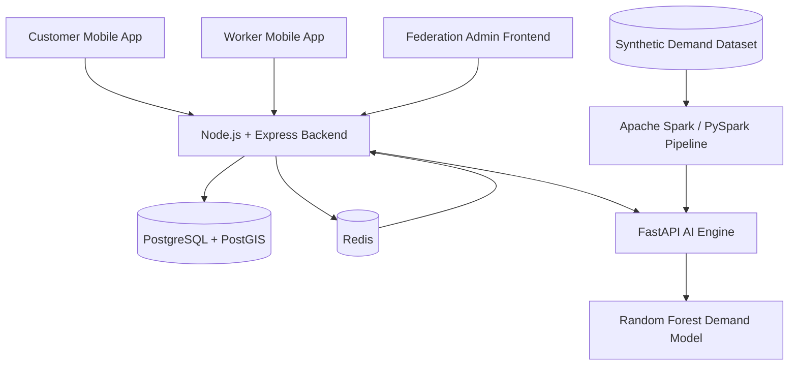

# ShramSaathi

> **A smart labour-cooperative service marketplace that connects customers with verified workers while using data engineering and machine learning to support demand forecasting and fair pricing.**

ShramSaathi is a full-stack platform designed around the workflow of a labour cooperative federation. Customers can discover services, request workers, make normal or emergency bookings, and track accepted emergency workers. Workers can manage their profiles, availability, bookings, and live location. A federation/admin layer provides operational visibility and an AI/data pipeline for demand analysis and pricing intelligence.

---

## Table of Contents

- [Overview](#overview)
- [Key Features](#key-features)
- [How ShramSaathi Works](#how-shramsaathi-works)
- [System Architecture](#system-architecture)
- [Technology Stack](#technology-stack)
- [Project Structure](#project-structure)
- [Prerequisites](#prerequisites)
- [Installation](#installation)
- [Running the Project](#running-the-project)
- [Spark Data Pipeline](#spark-data-pipeline)
- [Environment Configuration](#environment-configuration)
- [AI Engine](#ai-engine)
- [Admin Frontend](#admin-frontend)
- [Database and Redis](#database-and-redis)
- [API Overview](#api-overview)
- [Emergency Booking Flow](#emergency-booking-flow)
- [ML and Data Intelligence](#ml-and-data-intelligence)
- [Troubleshooting](#troubleshooting)
- [Future Enhancements](#future-enhancements)
- [Project Status](#project-status)

---

## Overview

ShramSaathi combines a **service marketplace**, **labour-cooperative workflow**, and **data-driven intelligence layer**.

The platform has four major runtime components:

1. **Mobile Application** — React Native + Expo application used by customers and workers.
2. **Backend API** — Node.js + Express API responsible for authentication, users, workers, bookings, matching, pricing, payments, and location services.
3. **AI Engine** — FastAPI service that exposes the trained demand-forecasting model and pricing intelligence.
4. **Admin Frontend** — Static HTML/CSS/JavaScript federation dashboard served locally through Python's built-in HTTP server.

A separate **Apache Spark / PySpark pipeline** processes synthetic demand data and produces aggregated demand insights. Spark is a data-processing pipeline, **not a continuously running server**.

---

## Key Features

### Customer

- User registration and authentication
- Customer profile and service requirements
- Browse available services and subcategories
- Select normal or emergency service
- Create and manage bookings
- View booking status
- Worker assignment for accepted requests
- Emergency worker tracking through live location
- Open the worker's location in maps
- Mock payment flow for the MVP

### Worker

- Worker registration and profile setup
- Skill/service selection
- Worker verification workflow
- Online/offline availability
- Accept or reject booking requests
- Booking status management
- Emergency booking participation
- Live GPS location updates during active emergency jobs

### Emergency Service

- Emergency booking request
- Search for suitable verified/online workers
- Offer-based worker assignment
- Worker response timeout handling
- Escalation to additional workers when required
- Dynamic emergency pricing support
- Live worker location after confirmation

### Federation/Admin Intelligence

- Worker and operational visibility
- Demand analytics
- City/category demand aggregation
- Demand forecasting through Random Forest Regression
- Fair-price recommendation logic
- Spark-generated demand insights
- Synthetic demand data pipeline for demonstration and experimentation

---

## How ShramSaathi Works

### Marketplace Flow

```text
Customer
   |
   v
Select Service
   |
   v
Select Subcategory / Requirement
   |
   +----------------------+
   |                      |
Normal Booking       Emergency Booking
   |                      |
   v                      v
Worker Matching      Emergency Matching
   |                      |
   v                      v
Worker Assigned      Worker Offer
   |                      |
   v                      v
Booking Confirmed    Worker Accepts
   |                      |
   +----------+-----------+
              |
              v
        Service Execution
              |
              v
          Completion
```

### Intelligence Flow

```text
Synthetic Demand Data
          |
          v
      Apache Spark
          |
          v
Demand Aggregation & Insights
          |
          +-------------------+
          |                   |
          v                   v
   Demand Analytics      ML Forecasting
                              |
                              v
                    Random Forest Model
                              |
                              v
                     Demand Prediction
                              |
                              v
                    Fair Price Suggestion
```

---

## System Architecture



> The diagram represents the logical architecture. Spark is executed as a data-processing job and does not need to remain running alongside the other services.

---

## Technology Stack

| Layer | Technology |
|---|---|
| Mobile application | React Native |
| Mobile tooling | Expo SDK 57 |
| Backend runtime | Node.js |
| Backend framework | Express 5 |
| Database | PostgreSQL |
| Geospatial database support | PostGIS |
| ORM | Prisma 7 |
| Caching / location store | Redis |
| Authentication | JWT + bcrypt |
| Image/file storage | Cloudinary |
| AI API | FastAPI |
| AI server | Uvicorn |
| ML | scikit-learn |
| Data processing | Apache Spark / PySpark |
| ML data handling | Pandas / NumPy |
| Admin frontend | HTML + CSS + JavaScript |
| Admin local server | Python `http.server` |

---

## Project Structure

The important parts of the repository are organized approximately as follows:

```text
ShramSaathi/
│
├── backend/
│   └── backend/
│       ├── src/
│       ├── prisma/
│       ├── package.json
│       └── ...
│
├── MobileApp/
│   ├── src/
│   ├── assets/
│   ├── package.json
│   └── ...
│
└── admin/
    │
    ├── ai-engine/
    │   ├── data/
    │   │   └── synthetic_demand.csv
    │   ├── model/
    │   │   ├── demand_forecaster.pkl
    │   │   └── metadata.json
    │   ├── features.py
    │   ├── main.py
    │   ├── train.py
    │   ├── spark_pipeline.py
    │   └── requirements.txt
    │
    └── frontend/
        ├── index.html
        ├── css/
        │   └── style.css
        └── js/
            ├── config.js
            ├── pricing.js
            └── workers.js
```

> The admin frontend is intentionally a **plain static frontend**. It is not a Vite/React application and therefore does not use `npm run dev`.

---

# Prerequisites

Install the following before running the project:

- **Node.js**
- **npm**
- **Python 3.13.x** (or a compatible Python version supported by the installed dependencies)
- **Java 17** — required by the current PySpark setup
- **PostgreSQL**
- **PostGIS** extension
- **Redis**
- **Expo-compatible mobile development environment**

For Android development, you can use:

- Android Studio + Android Emulator, or
- a physical Android device with Expo Go

---

# Installation

## 1. Clone the Repository

```bash
git clone <YOUR_REPOSITORY_URL>
cd ShramSaathi
```

---

## 2. Install Backend Dependencies

```powershell
cd .\backend\backend
npm install
```

---

## 3. Install Mobile Dependencies

Open a new terminal:

```powershell
cd .\MobileApp
npm install
```

---

## 4. Set Up the AI Engine

Open another terminal:

```powershell
cd .\admin\ai-engine
python -m venv venv
.\venv\Scripts\Activate.ps1
pip install -r requirements.txt
```

If PowerShell blocks activation, you can run the environment's Python directly:

```powershell
.\venv\Scripts\python.exe -m pip install -r requirements.txt
```

---

# Running the Project

ShramSaathi uses **four terminals** during normal local development.

## Terminal 1 — Backend API

```powershell
cd .\backend\backend
npm run dev
```

Backend:

```text
http://localhost:8000
```

The backend development script uses Nodemon and starts:

```text
src/server.js
```

---

## Terminal 2 — Mobile Application

```powershell
cd .\MobileApp
npx expo start
```

If you need to clear Expo's cache:

```powershell
npx expo start -c
```

Expo will display the available development options for an emulator or physical device.

---

## Terminal 3 — FastAPI AI Engine

This is the AI server running from the `admin/ai-engine` directory.

```powershell
cd .\admin\ai-engine
.\venv\Scripts\Activate.ps1
uvicorn main:app --host 0.0.0.0 --port 8001
```

AI engine:

```text
http://localhost:8001
```

Health check:

```text
http://localhost:8001/health
```

> **Important:** Do not use `npm run dev` or a Vite command here. The AI engine is a Python FastAPI application.

---

## Terminal 4 — Admin Frontend

The admin frontend is plain HTML/CSS/JavaScript.

```powershell
cd .\admin\frontend
python -m http.server 5500
```

Open:

```text
http://localhost:5500
```

> **Important:** There is no `package.json`, Vite configuration, or npm development script in the current admin frontend. Python's built-in HTTP server is the correct local server for it.

---

# Quick Start — All Four Commands

After installing everything, the four runtime terminals are:

### 1. Backend

```powershell
cd .\backend\backend
npm run dev
```

### 2. Mobile

```powershell
cd .\MobileApp
npx expo start
```

### 3. AI Engine

```powershell
cd .\admin\ai-engine
.\venv\Scripts\Activate.ps1
uvicorn main:app --host 0.0.0.0 --port 8001
```

### 4. Admin Frontend

```powershell
cd .\admin\frontend
python -m http.server 5500
```

---

# Spark Data Pipeline

The Spark pipeline is run separately when demand data needs to be processed.

It is **not a fifth server**.

Run:

```powershell
cd .\admin\ai-engine
.\venv\Scripts\Activate.ps1
python spark_pipeline.py
```

The pipeline reads the synthetic demand dataset and produces aggregated demand insights.

The generated output is:

```text
data/spark_output.json
```

### Current Spark pipeline summary

The existing generated analysis includes:

- Total jobs: **1,276,491**
- Average daily jobs: **106.37**
- Highest-demand day: **Saturday**
- Highest-demand month: **July**
- Highest city total: **Mumbai**
- Highest category total: **Plumber**
- Allocation insight: prioritize **Plumber demand in Mumbai**

These values are based on the project's current synthetic dataset and generated Spark output.

### Why synthetic data?

ShramSaathi does not yet have a large historical production booking dataset. Synthetic demand data is therefore used to demonstrate the data-engineering and forecasting workflow without claiming that the numbers represent real-world labour demand.

---

# Environment Configuration

## Backend

Configure the backend environment according to the variables expected by the backend implementation.

Typical development configuration includes:

```env
PORT=8000
DATABASE_URL=<POSTGRESQL_CONNECTION_STRING>
JWT_SECRET=<YOUR_JWT_SECRET>
REDIS_URL=<YOUR_REDIS_CONNECTION>
CLOUDINARY_CLOUD_NAME=<YOUR_CLOUDINARY_NAME>
CLOUDINARY_API_KEY=<YOUR_CLOUDINARY_KEY>
CLOUDINARY_API_SECRET=<YOUR_CLOUDINARY_SECRET>
AI_ENGINE_BASE_URL=http://127.0.0.1:8001
```

Use the project's actual backend `.env` template/configuration when available rather than copying placeholder values directly into production.

---

## Admin Frontend

The current admin frontend keeps its service endpoints in:

```text
admin/frontend/js/config.js
```

The local configuration is:

```javascript
const CONFIG = {
  BACKEND_API_BASE: 'http://localhost:8000/api',
  AI_ENGINE_BASE: 'http://localhost:8001'
};
```

If the services are hosted on another machine, update these addresses accordingly.

---

# AI Engine

The AI engine is a **FastAPI service** responsible for exposing the trained ML model through HTTP endpoints.

### Model

Current model:

```text
RandomForestRegressor
```

The trained model is stored under:

```text
admin/ai-engine/model/demand_forecaster.pkl
```

Model metadata is stored in:

```text
admin/ai-engine/model/metadata.json
```

### Supported prediction inputs

The current model supports the following categories:

- Electrician
- Plumber
- Carpenter
- Painter
- Domestic Helper
- Caregiver
- Technician

Supported cities:

- Bengaluru
- Mumbai
- Delhi
- Hyderabad

Supported weather conditions:

- Clear
- Rain
- Extreme heat

Supported event conditions:

- Normal day
- Holiday
- Major event

### Current model metadata

The current model metadata reports:

| Metric | Value |
|---|---:|
| Model | RandomForestRegressor |
| Model version | `1.0.0-rf` |
| MAE | `10.016` |
| R² | `0.6868` |
| Holdout fraction | `0.2` |

These metrics describe the current trained model and should be treated as experimental/MVP results rather than production performance guarantees.

---

# Fair Pricing Logic

ShramSaathi uses the demand prediction to support fair-price recommendations.

The current pricing logic calculates a demand-based multiplier using the predicted demand relative to a reference level:

```text
multiplier =
    clamp(
        0.82 + (demand_ratio - 0.75) × 0.54,
        0.82,
        1.18
    )
```

The suggested price is then calculated as:

```text
suggested_price = current_price × multiplier
```

The multiplier is bounded so that the recommendation does not move outside the configured pricing range.

This approach is intended to support **demand-aware pricing while keeping prices within controlled limits**.

---

# Database and Redis

## PostgreSQL + PostGIS

PostgreSQL stores persistent application data such as:

- Users
- Worker profiles
- Customer profiles
- Skills/services
- Bookings
- Booking states
- Worker-related records

PostGIS provides geospatial database support for location-related functionality.

Make sure PostgreSQL is running before starting the backend.

---

## Redis

Redis is used for fast-changing worker location information and matching-related operations.

The current worker location implementation uses keys in the form:

```text
worker:location:${workerId}
```

Worker location entries use an expiry so stale locations do not remain indefinitely.

The current implementation refreshes location information while relevant emergency work is active.

Make sure Redis is running before using features that depend on it.

---

# API Overview

The backend exposes REST APIs under:

```text
http://localhost:8000/api
```

Major functional areas include:

| Area | Purpose |
|---|---|
| Authentication | Registration, login and identity |
| Users | Customer/user profile operations |
| Workers | Worker profile and worker operations |
| Skills | Service and skill resolution |
| Bookings | Normal and emergency bookings |
| Matching | Worker discovery and assignment |
| Pricing | Demand-aware pricing support |
| Location | Worker location updates and retrieval |
| Payments | MVP/mock payment workflow |

The exact request/response schemas are defined by the backend source code.

---

# Emergency Booking Flow

Emergency service is one of the important differentiators of ShramSaathi.

The simplified flow is:

```text
Customer requests emergency service
              |
              v
      Backend validates request
              |
              v
     Find eligible workers
              |
              v
   Send worker booking offer
              |
        +-----+-----+
        |           |
      Accept      Reject/Timeout
        |           |
        v           v
   Confirm job    Try next worker
        |           |
        +-----+-----+
              |
              v
       Service execution
              |
              v
      Live location updates
```

Workers are considered according to the eligibility and availability logic implemented by the backend.

When an emergency booking is confirmed, the worker application can send location updates and the customer application can retrieve the current worker location.

---

# Worker Location Tracking

The emergency workflow supports live worker location.

### Worker side

The Worker Dashboard can:

1. Obtain the worker's GPS location.
2. Send updated coordinates to the backend.
3. Continue refreshing location while the relevant emergency job is active.

### Customer side

The User Dashboard can:

1. Poll the worker's current location.
2. Display the latest available location.
3. Provide an option to open the location in maps.

The location layer uses Redis for fast access to the latest worker position.

---

# ML + Data Engineering Layer

The intelligence layer is intentionally split into two responsibilities.

## Apache Spark

Spark handles the **data-engineering and aggregation stage**:

```text
Synthetic Records
       ↓
Spark Processing
       ↓
Cleaning / Aggregation
       ↓
City + Category + Time Insights
       ↓
Demand Analytics Output
```

Spark is therefore not presented as another prediction model.

## Machine Learning

The Random Forest model handles the **prediction stage**:

```text
Category
City
Weather
Day / Time Features
Event Context
       ↓
Random Forest Regressor
       ↓
Predicted Demand
```

The predicted demand can then contribute to the pricing recommendation layer.

This separation makes the architecture easier to explain:

> **Spark processes the data; ML predicts demand; the application uses the prediction to support operational and pricing decisions.**

---

# Development Workflow

A recommended development workflow is:

```text
1. Start PostgreSQL + PostGIS
2. Start Redis
3. Start Backend
4. Start AI Engine
5. Start Admin Frontend
6. Start Expo Mobile App
7. Run Spark pipeline when demand data needs regeneration
```

For normal application testing, Spark does not need to be running continuously.

---

# Troubleshooting

## Backend does not start

Check:

```powershell
node --version
npm --version
```

Then reinstall dependencies if required:

```powershell
cd .\backend\backend
npm install
npm run dev
```

Also verify PostgreSQL and Redis are running.

---

## AI Engine does not start

Make sure the virtual environment is activated:

```powershell
cd .\admin\ai-engine
.\venv\Scripts\Activate.ps1
```

Then:

```powershell
uvicorn main:app --host 0.0.0.0 --port 8001
```

If Uvicorn is not found:

```powershell
python -m pip install -r requirements.txt
```

Then retry.

---

## AI health check

Open:

```text
http://localhost:8001/health
```

The service should return a successful health response containing the loaded model information.

---

## Admin frontend does not open

Do **not** run:

```text
npm run dev
```

The current admin frontend is static.

Use:

```powershell
cd .\admin\frontend
python -m http.server 5500
```

Then open:

```text
http://localhost:5500
```

---

## Spark fails on Windows

The current project setup is intended to run the pipeline directly through Python:

```powershell
cd .\admin\ai-engine
.\venv\Scripts\Activate.ps1
python spark_pipeline.py
```

Do not assume `spark-submit` is configured in the current Windows environment.

The project has been tested with the current PySpark setup using Java 17.

---

## Mobile app cannot reach localhost

When the mobile application runs on a physical phone, `localhost` refers to the phone itself, not your development PC.

Use the computer's local network IP for backend/AI URLs where required, and make sure:

- PC and phone are on the same network
- Windows Firewall permits the required ports
- Backend is reachable from the phone
- AI engine is reachable if the mobile workflow calls it directly

For Android Emulator, the networking address may differ from a physical device.

---

# Ports

| Component | Port |
|---|---:|
| Backend API | `8000` |
| AI Engine | `8001` |
| Admin Frontend | `5500` |
| PostgreSQL | `5432` |
| Redis | `6379` |
| Expo | Managed by Expo |

---

# Security Notes

The current project is an MVP/SIH implementation.

Before production deployment, additional work should be done around:

- Secret management
- HTTPS/TLS
- Strong production JWT configuration
- API rate limiting
- Input validation and sanitization
- Role/permission hardening
- Secure CORS configuration
- Production database security
- Redis authentication/network isolation
- Payment gateway integration
- Audit logging
- Monitoring and observability

Never commit real API keys, database passwords, JWT secrets, or Cloudinary credentials to the repository.

---

# Future Enhancements

Planned or natural future improvements include:

- Real Razorpay payment integration
- Production deployment
- Stronger worker verification
- Improved worker matching using distance and availability
- Better real-time location delivery using WebSockets
- More historical demand data
- Improved ML models and continuous retraining
- Automated Spark data ingestion
- Federation-level analytics dashboards
- Notifications for booking offers and status changes
- Ratings and reviews
- Service completion verification
- More robust emergency escalation policies

---

# Project Differentiators

ShramSaathi is more than a basic service-booking application.

Its core differentiators are:

### 1. Labour Cooperative Model

The system is designed around a federation/cooperative structure rather than only a conventional gig-marketplace model.

### 2. Emergency Worker Matching

Emergency requests use a faster worker-offer and escalation workflow.

### 3. Data Engineering + AI

The project demonstrates an end-to-end intelligence pipeline:

```text
Data
  ↓
Apache Spark
  ↓
Demand Analytics
  ↓
Machine Learning
  ↓
Demand Prediction
  ↓
Fair Pricing
  ↓
Marketplace Decision Support
```

### 4. Live Emergency Tracking

Accepted emergency workers can share their live location so customers can monitor the worker's movement toward the job.

### 5. Controlled Pricing

Demand-aware pricing is bounded by configured limits instead of allowing unrestricted price changes.

---

# Local Development Checklist

Before a full demo, verify:

- [ ] PostgreSQL is running
- [ ] PostGIS is available
- [ ] Redis is running
- [ ] Backend starts on port `8000`
- [ ] AI engine starts on port `8001`
- [ ] `http://localhost:8001/health` works
- [ ] Admin frontend opens on port `5500`
- [ ] Mobile app starts through Expo
- [ ] Customer registration/login works
- [ ] Worker registration/profile works
- [ ] Normal booking works
- [ ] Emergency booking works
- [ ] Worker accept/reject flow works
- [ ] Worker location updates work for emergency jobs
- [ ] Customer can retrieve/open worker location
- [ ] AI pricing/demand endpoint works
- [ ] Spark pipeline can regenerate `spark_output.json`

---

# Demo Sequence

For an SIH/project demonstration, a strong end-to-end sequence is:

```text
Customer Login
      ↓
Select Service
      ↓
Choose Normal / Emergency
      ↓
Create Booking
      ↓
Worker Matching
      ↓
Worker Accepts
      ↓
Booking Confirmation
      ↓
Emergency → Live Worker Location
      ↓
AI Demand / Pricing Intelligence
      ↓
Federation Admin Dashboard
```

This demonstrates both sides of the project:

**Operational Marketplace + Data/AI Intelligence**

---

