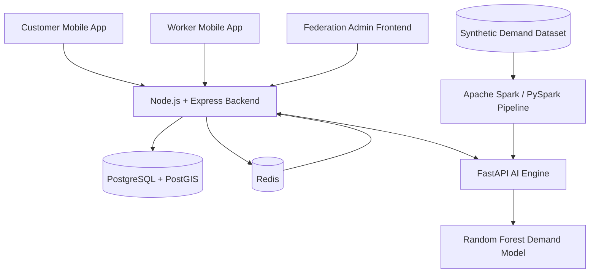

# ShramSaathi

> **A smart labour-cooperative service marketplace connecting customers with verified workers, supported by data engineering, machine learning, fair-pricing logic, and emergency worker tracking.**

ShramSaathi is a full-stack platform designed around a labour-cooperative federation model. Customers can discover services, create normal or emergency bookings, and track accepted emergency workers. Workers can manage their profiles, skills, availability, bookings, earnings, and live location. A federation/admin layer provides operational visibility and data-driven demand and pricing intelligence.

---

## Table of Contents

- [Overview](#overview)
- [Key Features](#key-features)
- [How ShramSaathi Works](#how-shramsaathi-works)
- [System Architecture](#system-architecture)
- [Technology Stack](#technology-stack)
- [Project Structure](#project-structure)
- [Prerequisites](#prerequisites)
- [Installation](#installation)
- [Running the Project](#running-the-project)
- [Spark Data Pipeline](#spark-data-pipeline)
- [Environment Configuration](#environment-configuration)
- [AI Engine](#ai-engine)
- [Fair Pricing](#fair-pricing)
- [Database and Redis](#database-and-redis)
- [API Overview](#api-overview)
- [Emergency Booking Flow](#emergency-booking-flow)
- [Worker Location Tracking](#worker-location-tracking)
- [ML + Data Engineering Layer](#ml--data-engineering-layer)
- [Development Workflow](#development-workflow)
- [Troubleshooting](#troubleshooting)
- [Ports](#ports)
- [Security Notes](#security-notes)
- [Future Enhancements](#future-enhancements)
- [Project Differentiators](#project-differentiators)
- [Local Development Checklist](#local-development-checklist)
- [Demo Sequence](#demo-sequence)

---

## Overview

ShramSaathi combines three core ideas:

1. **Service marketplace** — customers can request services from available workers.
2. **Labour-cooperative workflow** — workers are represented through profiles, skills, verification, availability, and federation-level administration.
3. **Data and AI intelligence** — demand data is processed with Apache Spark and used by a Random Forest model to support demand forecasting and fair-price recommendations.

The platform consists of four main runtime components:

| Component | Responsibility |
|---|---|
| Mobile Application | Customer and worker workflows |
| Backend API | Authentication, profiles, skills, bookings, matching, pricing, payments, and location |
| AI Engine | Demand forecasting and intelligence APIs |
| Admin Frontend | Federation/admin operations and analytics |

Apache Spark is used separately as a data-processing pipeline. It is a job, not a continuously running server.

---

## Key Features

### Customer

- Registration and authentication
- Customer profile management
- Browse service categories and subcategories
- Normal and emergency service requests
- AI-backed price estimation
- Booking creation and status tracking
- Worker assignment
- Emergency worker location tracking
- Open worker location in maps
- MVP/mock payment workflow

### Worker

- Registration and profile setup
- Primary and additional skill selection
- Worker verification workflow
- Online/offline availability
- Accept or reject booking requests
- Booking status management
- Earnings calculation
- Emergency booking participation
- Live GPS location updates during active emergency jobs

### Emergency Service

- Immediate emergency booking requests
- Matching with eligible verified/online workers
- Worker offer and response workflow
- Response timeout handling
- Escalation to additional workers
- Emergency pricing using demand and contextual inputs
- Live worker tracking after confirmation

### Federation/Admin Intelligence

- Worker and operational visibility
- Demand analytics
- City/category demand aggregation
- Random Forest demand forecasting
- Bounded fair-price recommendation logic
- Spark-generated demand insights
- Synthetic demand-data pipeline

---

## How ShramSaathi Works

### Marketplace Flow

```text
Customer
   |
   v
Select Service
   |
   v
Select Subcategory / Requirement
   |
   +----------------------+
   |                      |
   v                      v
Normal Booking       Emergency Booking
   |                      |
   v                      v
Worker Matching      Emergency Matching
   |                      |
   v                      v
Worker Assigned      Worker Offer
   |                      |
   v                      v
Booking Confirmed    Worker Accepts
   |                      |
   +----------+-----------+
              |
              v
       Service Execution
              |
              v
          Completion
```

### Intelligence Flow

```text
Synthetic Demand Data
        |
        v
Apache Spark
        |
        v
Demand Aggregation
        |
        +-------------------+
        |                   |
        v                   v
Demand Analytics      ML Forecasting
                            |
                            v
                    Random Forest Model
                            |
                            v
                     Demand Prediction
                            |
                            v
                     Price Recommendation
```

---

## System Architecture




> Spark is executed as a data-processing job and does not need to remain running alongside the application services.

---

## Technology Stack

| Layer | Technology |
|---|---|
| Mobile application | React Native |
| Mobile tooling | Expo SDK 57 |
| Backend runtime | Node.js |
| Backend framework | Express 5 |
| Database | PostgreSQL |
| Geospatial support | PostGIS |
| ORM | Prisma 7 |
| Caching / location store | Redis |
| Authentication | JWT + bcrypt |
| Image/file storage | Cloudinary |
| AI API | FastAPI |
| AI server | Uvicorn |
| Machine Learning | scikit-learn |
| Data processing | Apache Spark / PySpark |
| Data handling | Pandas / NumPy |
| Admin frontend | HTML + CSS + JavaScript |
| Admin local server | `http-server` or Python `http.server` |

---

## Project Structure

```text
ShramSaathi/
│
├── backend/
│   ├── src/
│   │   ├── config/
│   │   ├── controllers/
│   │   ├── routes/
│   │   ├── services/
│   │   └── server.js
│   ├── prisma/
│   │   └── schema.prisma
│   ├── package.json
│   └── .env
│
├── MobileApp/
│   ├── src/
│   │   ├── api.ts
│   │   └── app/
│   │       ├── userdashboard/
│   │       ├── worker/
│   │       └── workerdetails/
│   ├── assets/
│   ├── package.json
│   └── ...
│
└── admin/
    ├── ai-engine/
    │   ├── data/
    │   │   └── synthetic_demand.csv
    │   ├── model/
    │   │   ├── demand_forecaster.pkl
    │   │   └── metadata.json
    │   ├── features.py
    │   ├── main.py
    │   ├── train.py
    │   ├── spark_pipeline.py
    │   └── requirements.txt
    │
    └── frontend/
        ├── index.html
        ├── css/
        │   └── style.css
        └── js/
            ├── config.js
            ├── pricing.js
            └── workers.js
```

> The admin frontend is a plain static frontend. It is not a Vite/React application.

---

## Prerequisites

Install the following:

- Node.js
- npm
- Python 3.13.x or a compatible Python version supported by the project dependencies
- Java 17 for the current PySpark setup
- PostgreSQL
- PostGIS extension
- Redis
- Expo-compatible mobile development environment

For Android development, use either:

- Android Studio + Android Emulator
- A physical Android device with Expo Go

---

## Installation

### 1. Clone the Repository

```powershell
git clone <YOUR_REPOSITORY_URL>
cd ShramSaathi
```

### 2. Install Backend Dependencies

```powershell
cd .\backend
npm install
```

### 3. Install Mobile Dependencies

Open a new terminal:

```powershell
cd .\MobileApp
npm install
```

### 4. Set Up the AI Engine

Open another terminal:

```powershell
cd .\admin\ai-engine
python -m venv .venv
.\.venv\Scripts\Activate.ps1
pip install -r requirements.txt
```

If PowerShell blocks activation:

```powershell
.\.venv\Scripts\python.exe -m pip install -r requirements.txt
```

---

## Running the Project

ShramSaathi normally uses four terminals.

### Terminal 1 — Backend API

```powershell
cd .\backend
npm start
```

Backend:

```text
http://localhost:5000
```

### Terminal 2 — Mobile Application

```powershell
cd .\MobileApp
npx expo start
```

To clear Expo cache:

```powershell
npx expo start -c
```

### Terminal 3 — FastAPI AI Engine

```powershell
cd .\admin\ai-engine
py main.py
```

Or:

```powershell
.\.venv\Scripts\python.exe main.py
```

AI Engine:

```text
http://localhost:8001
```

Health check:

```text
http://localhost:8001/health
```

> Do not use `npm run dev` for the AI engine. It is a Python FastAPI application.

### Terminal 4 — Admin Frontend

```powershell
cd .\admin\frontend
npx http-server -p 3000
```

Alternatively:

```powershell
python -m http.server 5500
```

Open:

```text
http://localhost:3000
```

> The admin frontend does not use Vite or `npm run dev`.

### Quick Start

```text
Terminal 1:
cd .\backend
npm start

Terminal 2:
cd .\MobileApp
npx expo start

Terminal 3:
cd .\admin\ai-engine
py main.py

Terminal 4:
cd .\admin\frontend
npx http-server -p 3000
```

---

## Spark Data Pipeline

Spark is run separately when demand data needs to be processed.

```powershell
cd .\admin\ai-engine
python spark_pipeline.py
```

The pipeline reads the synthetic demand dataset and produces aggregated demand insights.

Output:

```text
data/spark_output.json
```

### Important

Spark is **not a fifth server**. It does not need to remain running during normal application usage.

### Synthetic Data

The current project uses synthetic demand data because it does not yet have a large historical production booking dataset.

Therefore, generated demand statistics are intended for:

- Demonstration
- Data-engineering experimentation
- ML experimentation
- SIH/project presentation

They should not be interpreted as real-world labour-demand measurements.

---

## Environment Configuration

### Backend

Create/configure:

```text
backend/.env
```

Example structure:

```env
PORT=5000
DATABASE_URL=<YOUR_DATABASE_URL>
JWT_SECRET=<YOUR_JWT_SECRET>
REDIS_URL=redis://localhost:6379

CLOUDINARY_CLOUD_NAME=<YOUR_CLOUDINARY_NAME>
CLOUDINARY_API_KEY=<YOUR_CLOUDINARY_KEY>
CLOUDINARY_API_SECRET=<YOUR_CLOUDINARY_SECRET>

AI_ENGINE_BASE_URL=http://127.0.0.1:8001

WORKER_SHARE_PERCENT=80
WELFARE_SHARE_PERCENT=10
PLATFORM_SHARE_PERCENT=10
```

Use your actual environment configuration locally. Never commit real credentials.

### Admin Frontend

The API configuration is located at:

```text
admin/frontend/js/config.js
```

Local development configuration:

```javascript
const CONFIG = {
  BACKEND_API_BASE: 'http://localhost:5000/api',
  AI_ENGINE_BASE: 'http://localhost:8001'
};
```

If the services run on another machine, update these addresses accordingly.

---

## AI Engine

The AI engine is a FastAPI service exposing the trained ML model through HTTP endpoints.

### Model

Current model:

```text
RandomForestRegressor
```

Model file:

```text
admin/ai-engine/model/demand_forecaster.pkl
```

Metadata:

```text
admin/ai-engine/model/metadata.json
```

### Current Model Inputs

The current model supports service categories including:

- Electrician
- Plumber
- Carpenter
- Painter
- Domestic Helper
- Caregiver
- Technician

Current city categories include:

- Bengaluru
- Mumbai
- Delhi
- Hyderabad

Current weather conditions include:

- Clear
- Rain
- Extreme heat

Current event conditions include:

- Normal day
- Holiday
- Major event

### Model Metadata

| Metric | Value |
|---|---:|
| Model | RandomForestRegressor |
| Version | `1.0.0-rf` |
| MAE | `10.016` |
| R² | `0.6868` |
| Holdout fraction | `0.2` |

These are current MVP/experimental model metrics, not production performance guarantees.

---

## Fair Pricing

ShramSaathi uses demand predictions to support demand-aware price recommendations.

The current demand multiplier is bounded between `0.82×` and `1.18×`:

```text
multiplier =
    clamp(
        0.82 + (demand_ratio - 0.75) × 0.54,
        0.82,
        1.18
    )
```

The suggested price is then:

```text
suggested_price = current_price × multiplier
```

The configured bounds are intended to prevent the recommendation from moving outside the controlled pricing range.

---

## Database and Redis

### PostgreSQL + PostGIS

PostgreSQL stores persistent application data such as:

- User profiles
- Worker profiles
- Customer profiles
- Worker skills
- Primary skill information
- Service categories
- Bookings
- Booking states
- Worker documents

PostGIS provides geospatial database capabilities for location-related functionality.

### Redis

Redis is used for fast-changing worker location data and matching-related operations.

Worker location keys follow the pattern:

```text
worker:location:${workerId}
```

Location entries use expiry so stale locations do not remain indefinitely.

---

## API Overview

The backend API is available under:

```text
http://localhost:5000/api
```

Major functional areas include:

| Area | Purpose |
|---|---|
| Authentication | Registration and login |
| Customer | Customer profile operations |
| Workers | Worker profile and skill resolution |
| Skills | Service and skill categories |
| Bookings | Normal and emergency bookings |
| Matching | Worker discovery and assignment |
| Pricing | Dynamic pricing and prediction |
| Location | Worker location updates/retrieval |
| Payments | MVP/mock payment workflow |

The exact request and response schemas are defined by the backend source code.

---

## Emergency Booking Flow

```text
Customer requests emergency service
                |
                v
       Backend validates request
                |
                v
        Find eligible workers
                |
                v
       Send worker booking offer
                |
          +-----+-----+
          |           |
        Accept    Reject/Timeout
          |           |
          v           v
    Confirm job   Try next worker
          |           |
          +-----+-----+
                |
                v
         Service execution
                |
                v
       Live location updates
```

Workers are selected according to the eligibility, skill, verification, and availability logic implemented by the backend.

---

## Worker Location Tracking

### Worker Side

During an active emergency job, the worker application can:

1. Obtain GPS coordinates.
2. Send updated coordinates to the backend.
3. Continue refreshing location while the relevant job is active.

### Customer Side

The customer application can:

1. Retrieve the worker's latest location.
2. Display the available location.
3. Open the location in maps.

Redis is used for fast access to the latest worker position.

---

## ML + Data Engineering Layer

The intelligence layer separates **data processing** from **machine learning prediction**.

### Apache Spark

Spark handles data engineering and aggregation:

```text
Synthetic Records
       |
       v
Spark Processing
       |
       v
Cleaning / Aggregation
       |
       v
City + Category + Time Insights
       |
       v
Demand Analytics Output
```

### Machine Learning

The Random Forest model handles demand prediction:

```text
Category
City
Weather
Day / Time Features
Event Context
       |
       v
Random Forest Regressor
       |
       v
Predicted Demand
       |
       v
Price Recommendation
```

In simple terms:

> **Spark processes the data. ML predicts demand. The application uses the prediction to support operational and pricing decisions.**

---

## Development Workflow

Recommended startup order:

```text
1. Start PostgreSQL + PostGIS
2. Start Redis
3. Start Backend API
4. Start AI Engine
5. Start Admin Frontend
6. Start Expo Mobile App
7. Run Spark pipeline when demand data needs regeneration
```

Spark does not need to run continuously.

---

## Troubleshooting

### Backend Does Not Start

Check:

```powershell
node --version
npm --version
```

Then:

```powershell
cd .\backend
npm install
npm start
```

Also verify PostgreSQL and Redis are running.

### AI Engine Does Not Start

```powershell
cd .\admin\ai-engine
py main.py
```

Or:

```powershell
.\.venv\Scripts\python.exe main.py
```

If packages are missing:

```powershell
pip install -r requirements.txt
```

### AI Health Check

Open:

```text
http://localhost:8001/health
```

The endpoint should return a successful health response.

### Admin Frontend Does Not Open

Do not use:

```text
npm run dev
```

Use:

```powershell
cd .\admin\frontend
npx http-server -p 3000
```

Then:

```text
http://localhost:3000
```

### Spark Fails on Windows

Run the pipeline directly through Python:

```powershell
cd .\admin\ai-engine
python spark_pipeline.py
```

The current setup uses Java 17 with PySpark.

### Mobile App Cannot Reach Localhost

On a physical phone, `localhost` refers to the phone itself, not your development PC.

Use your computer's local network IP for backend/AI URLs when necessary.

Make sure:

- PC and phone are on the same network
- Windows Firewall allows the required ports
- Backend is reachable from the phone
- AI Engine is reachable if the mobile workflow calls it directly

For Android Emulator, networking addresses may differ from a physical device.

---

## Ports

| Component | Port |
|---|---:|
| Backend API | `5000` |
| AI Engine | `8001` |
| Admin Frontend | `3000` |
| PostgreSQL | `5432` |
| Redis | `6379` |
| Expo | Managed by Expo |

---

## Security Notes

ShramSaathi is currently an MVP/SIH implementation.

Before production deployment, additional work is required around:

- Secret management
- HTTPS/TLS
- Production JWT configuration
- API rate limiting
- Input validation and sanitization
- Role and permission hardening
- Secure CORS configuration
- Production database security
- Redis authentication/network isolation
- Payment gateway integration
- Audit logging
- Monitoring and observability

**Never commit real API keys, database passwords, JWT secrets, Cloudinary credentials, or other secrets to Git.**

---

## Future Enhancements

Potential future improvements include:

- Real Razorpay/payment gateway integration
- Production deployment
- Stronger worker verification
- Improved distance- and availability-aware worker matching
- WebSocket-based real-time location delivery
- Larger historical demand datasets
- Improved ML models and continuous retraining
- Automated Spark data ingestion
- Federation-level analytics
- Booking notifications
- Ratings and reviews
- Service-completion verification
- More robust emergency escalation policies

---

## Project Differentiators

### 1. Labour Cooperative Model

The platform is designed around a federation/cooperative structure rather than only a conventional gig-marketplace workflow.

### 2. Emergency Worker Matching

Emergency requests use a faster worker-offer and escalation workflow.

### 3. Data Engineering + AI

The project demonstrates an end-to-end pipeline:

```text
Data
  ↓
Apache Spark
  ↓
Demand Analytics
  ↓
Machine Learning
  ↓
Demand Prediction
  ↓
Price Recommendation
  ↓
Marketplace Decision Support
```

### 4. Live Emergency Tracking

Accepted emergency workers can share their live location so customers can monitor their movement toward the job.

### 5. Controlled Pricing

Demand-aware pricing is bounded by configured limits, while worker earnings and platform/welfare shares are calculated explicitly.

---

## Local Development Checklist

Before a full demo, verify:

- [ ] PostgreSQL is running
- [ ] PostGIS is available
- [ ] Redis is running
- [ ] Backend starts on port `5000`
- [ ] AI Engine starts on port `8001`
- [ ] `http://localhost:8001/health` works
- [ ] Admin frontend opens on port `3000`
- [ ] Mobile app starts through Expo
- [ ] Customer registration/login works
- [ ] Worker registration works
- [ ] Worker primary-skill resolution works
- [ ] Normal booking works
- [ ] Emergency booking works
- [ ] Worker accept/reject flow works
- [ ] Worker location updates work for emergency jobs
- [ ] Customer can retrieve/open worker location
- [ ] AI pricing/demand endpoint works
- [ ] Spark pipeline can regenerate `spark_output.json`

---

## Demo Sequence

For an SIH/project demonstration:

```text
Customer Login
      ↓
Select Service
      ↓
Choose Normal / Emergency
      ↓
Create Booking
      ↓
Worker Matching
      ↓
Worker Accepts
      ↓
Booking Confirmation
      ↓
Emergency → Live Worker Location
      ↓
AI Demand / Pricing Intelligence
      ↓
Federation Admin Dashboard
```

This demonstrates both sides of the project:

**Operational Marketplace + Data/AI Intelligence**

---

## License

Add the project's chosen license here before publishing the repository publicly.

## Contributors

Add the ShramSaathi team members and their roles here.
