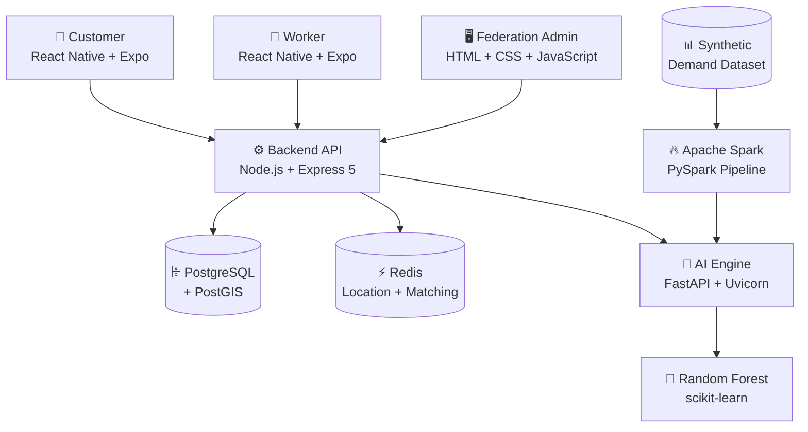
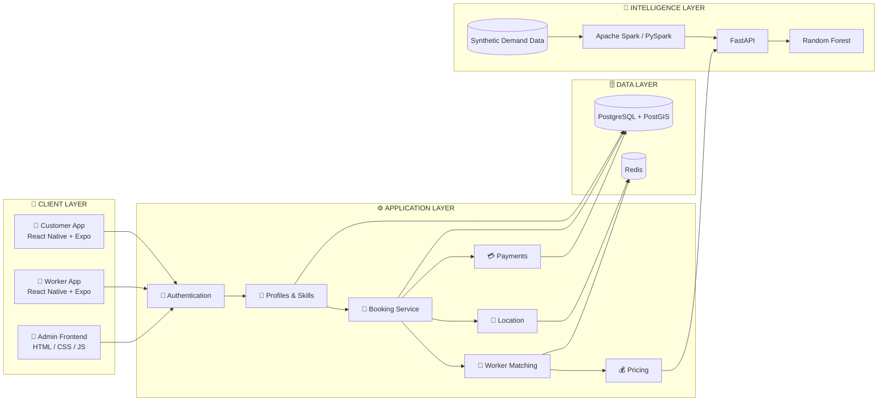
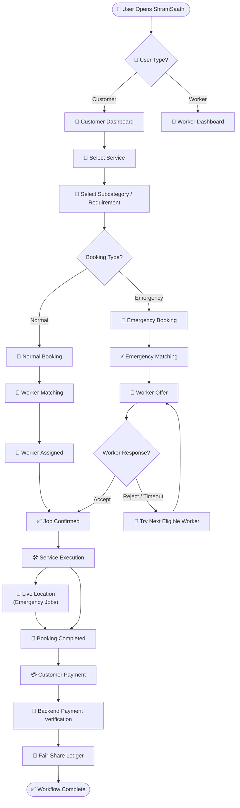
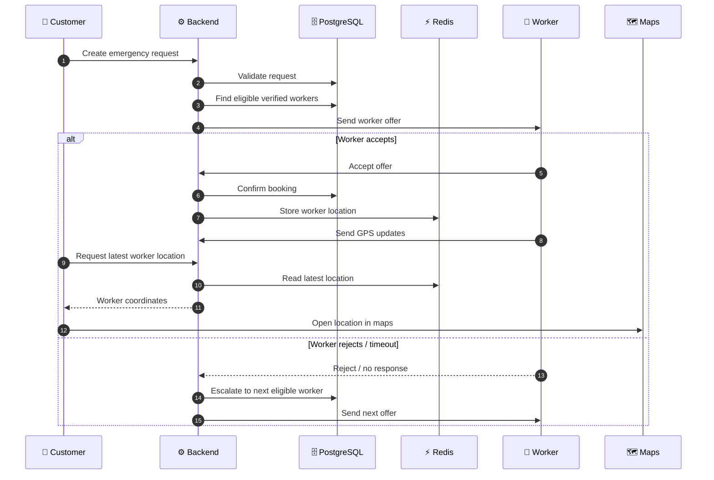
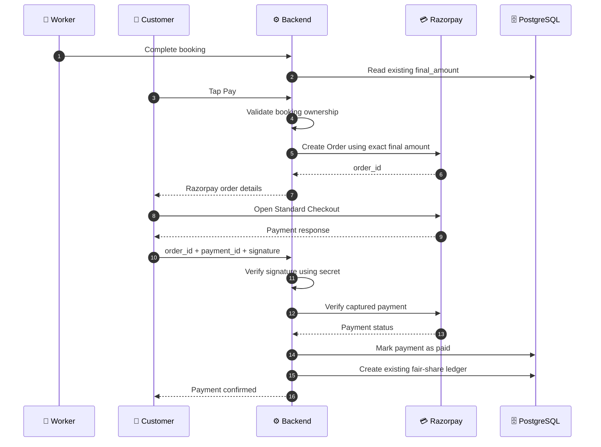
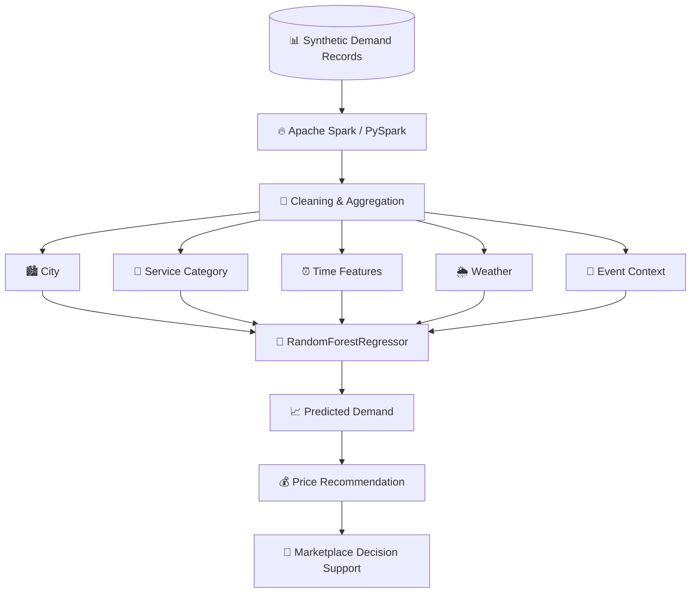
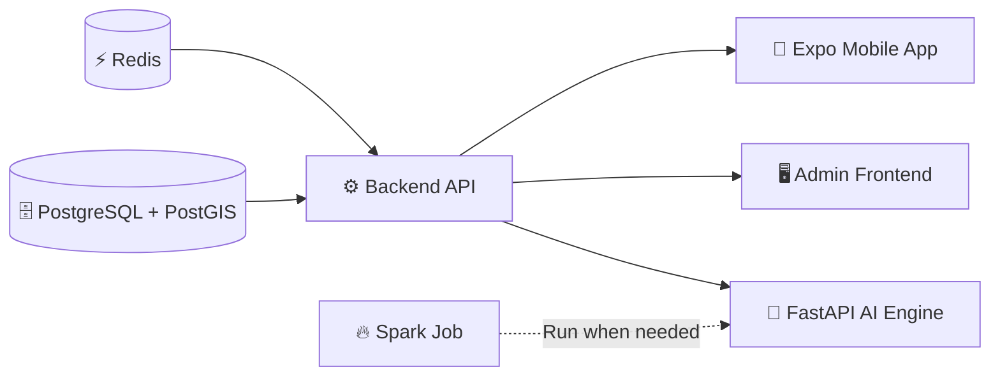
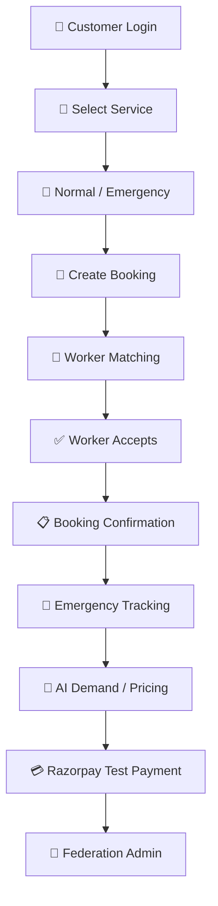

# 🛠️ ShramSaathi

<p align="center">
  
  
</p>

<p align="center"><b>A smart labour-cooperative service marketplace connecting customers with verified workers, powered by data engineering, machine learning, fair-pricing logic, emergency matching, and live worker tracking.</b></p>

<p align="center">📱 Customer & Worker Mobile App • ⚙️ Node/Express API • 🤖 FastAPI + ML • 📊 Apache Spark • 🗄️ PostgreSQL/PostGIS & Redis</p>

---

## ✨ What is ShramSaathi?

**ShramSaathi** is a full-stack labour-service marketplace built around a **labour-cooperative federation model**. It connects customers who need household or technical services with workers who can provide them. The platform supports **normal bookings** and **emergency service requests**, while a federation/admin layer provides operational visibility and data-driven demand and pricing intelligence.

| Component | Role |
|---|---|
| 📱 **Mobile Application** | Customer and worker workflows |
| ⚙️ **Backend API** | Authentication, profiles, skills, bookings, matching, pricing, payments and location |
| 🤖 **AI Engine** | Demand forecasting and intelligence APIs |
| 🖥️ **Admin Frontend** | Federation/admin operations and analytics |
| 📊 **Spark Pipeline** | Separate data-processing and aggregation job |

> **Important:** Apache Spark is a processing job, not a continuously running application server.

---

# 🌟 Why ShramSaathi?

### 🤝 Labour-Cooperative Model
Workers are represented through profiles, skills, verification, availability, bookings and federation-level administration rather than being treated only as marketplace listings.

### 🚨 Emergency Service Workflow
Emergency requests use a faster worker-offer, response-timeout and escalation workflow.

### 🧠 Data + AI
Synthetic demand data is processed through Apache Spark and used by a Random Forest model to support demand forecasting and price recommendations.

### 📍 Live Emergency Tracking
Once an emergency worker accepts a job, the worker application can send GPS updates and the customer can retrieve the latest available position.

### ⚖️ Controlled Fair Pricing
Demand-aware pricing is bounded by configured limits rather than allowing an unrestricted multiplier.

### 💳 Razorpay Test-Mode Integration
The payment flow can use Razorpay Standard Checkout in Test Mode while reusing the existing booking amount, payment record and fair-share ledger.

---

# 🧩 Core Features

## 👤 Customer

- Registration and authentication
- Customer profile management
- Browse service categories and subcategories
- Normal service bookings
- Emergency service requests
- AI-backed price estimation
- Booking creation and status tracking
- Worker assignment
- Emergency worker location tracking
- Open worker location in maps
- Test-mode payment workflow
- Payment verification through the backend

## 👷 Worker

- Registration and profile setup
- Primary and additional skill selection
- Worker verification workflow
- Online/offline availability
- Accept/reject booking requests
- Booking status management
- Earnings calculation
- Emergency booking participation
- Live GPS location updates during active emergency jobs
- Existing worker 80% share after successful payment

## 🚨 Emergency Service

```text
Customer Request
       │
       ▼
Backend Validation
       │
       ▼
Eligible Worker Search
       │
       ▼
Worker Offer
       │
   ┌───┴────────────┐
   │                │
 Accept        Reject / Timeout
   │                │
   ▼                ▼
Confirm Job     Try Next Worker
   │
   ▼
Service Execution
   │
   ▼
Live Location Updates
```

## 🏢 Federation / Admin Intelligence

- Worker and operational visibility
- Demand analytics
- City/category demand aggregation
- Random Forest demand forecasting
- Bounded fair-price recommendation
- Spark-generated demand insights
- Synthetic demand-data pipeline

---

# 🏗️ System Architecture

## High-Level Architecture



> The Spark pipeline is executed separately when demand data needs to be processed or regenerated.

## Application Architecture by Layer



---

# 🔄 Complete Marketplace Workflow



---

# 🚨 Emergency Booking Architecture



---

# 💳 Razorpay Payment Architecture

The Razorpay integration uses **Standard Checkout in Test Mode**.



### Payment Rules

- Existing booking `final_amount` becomes the customer payable amount.
- Razorpay Order amount is sent in INR paise.
- Signature verification happens on the backend.
- `RAZORPAY_KEY_SECRET` is **never** placed in the mobile application.
- Existing payment fields are reused.
- Existing fair-share ledger is reused.
- Worker earnings continue using the existing **80% share**.
- Only paid bookings contribute to paid worker earnings.
- No Prisma migration is required for this integration.

---

# 🧠 ML + Data Engineering Architecture



### Current ML Model

| Metric | Current Value |
|---|---:|
| Model | `RandomForestRegressor` |
| Version | `1.0.0-rf` |
| MAE | `10.016` |
| R² | `0.6868` |
| Holdout fraction | `0.2` |

### Current model categories

**Services:** Electrician, Plumber, Carpenter, Painter, Domestic Helper, Caregiver, Technician.

**Cities:** Bengaluru, Mumbai, Delhi, Hyderabad.

**Weather:** Clear, Rain, Extreme heat.

**Events:** Normal day, Holiday, Major event.

> These are current MVP/experimental metrics and should not be interpreted as production performance guarantees.

---

# 💰 Fair Pricing Logic

ShramSaathi uses predicted demand to support demand-aware price recommendations.

The current multiplier is bounded between **0.82× and 1.18×**.

```text
multiplier =
    clamp(
        0.82 + (demand_ratio - 0.75) × 0.54,
        0.82,
        1.18
    )

suggested_price = current_price × multiplier
```

---

# 🗄️ Data & Infrastructure

## PostgreSQL + PostGIS

Persistent application data includes user profiles, worker profiles, customer profiles, worker skills, primary skill information, service categories, bookings, booking states and worker documents.

**PostGIS** provides geospatial database capabilities for location-related functionality.

## Redis

Redis handles fast-changing worker location data and matching-related operations.

Location keys follow:

```text
worker:location:${workerId}
```

Location entries use expiry so stale positions do not remain indefinitely.

---

# 🧰 Technology Stack

<p align="center">


</p>
<p align="center">


</p>
<p align="center">


</p>
<p align="center">


</p>

| Layer | Technology |
|---|---|
| 📱 Mobile | React Native |
| 📦 Mobile tooling | Expo SDK 57 |
| ⚙️ Backend runtime | Node.js |
| 🚀 Backend framework | Express 5 |
| 🗄️ Database | PostgreSQL |
| 📍 Geospatial | PostGIS |
| 🔷 ORM | Prisma 7 |
| ⚡ Cache / location store | Redis |
| 🔐 Authentication | JWT + bcrypt |
| ☁️ Image/file storage | Cloudinary |
| 🤖 AI API | FastAPI |
| 🦄 AI server | Uvicorn |
| 🌲 Machine Learning | scikit-learn |
| 🔥 Data processing | Apache Spark / PySpark |
| 🐼 Data handling | Pandas / NumPy |
| 🖥️ Admin frontend | HTML + CSS + JavaScript |
| 💳 Payments | Razorpay Standard Checkout — Test Mode |

---

# 📁 Project Structure

```text
ShramSaathi/
│
├── backend/
│   ├── src/
│   │   ├── config/
│   │   ├── controllers/
│   │   ├── routes/
│   │   ├── services/
│   │   └── server.js
│   ├── prisma/
│   │   └── schema.prisma
│   ├── package.json
│   └── .env
│
├── MobileApp/
│   ├── src/
│   │   ├── api.ts
│   │   └── app/
│   │       ├── userdashboard/
│   │       ├── worker/
│   │       └── workerdetails/
│   ├── assets/
│   ├── package.json
│   └── ...
│
└── admin/
    ├── ai-engine/
    │   ├── data/
    │   │   └── synthetic_demand.csv
    │   ├── model/
    │   │   ├── demand_forecaster.pkl
    │   │   └── metadata.json
    │   ├── features.py
    │   ├── main.py
    │   ├── train.py
    │   ├── spark_pipeline.py
    │   └── requirements.txt
    │
    └── frontend/
        ├── index.html
        ├── css/
        │   └── style.css
        └── js/
            ├── config.js
            ├── pricing.js
            └── workers.js
```

> The admin frontend is a plain static frontend. It is **not** a Vite/React application.

---

# 🛠️ Prerequisites

Install:

- Node.js
- npm
- Python 3.13.x or a compatible version supported by project dependencies
- Java 17 for the current PySpark setup
- PostgreSQL
- PostGIS extension
- Redis
- Expo-compatible mobile development environment

For Android development, use either Android Studio + Android Emulator or a physical Android device with Expo Go.

---

# 🚀 Installation

## 1. Clone the repository

```powershell
git clone <YOUR_REPOSITORY_URL>
cd ShramSaathi
```

## 2. Backend

```powershell
cd .\backend
npm install
```

## 3. Mobile application

```powershell
cd .\MobileApp
npm install
```

## 4. AI engine

```powershell
cd .\admin\ai-engine
python -m venv .venv
.\.venv\Scripts\Activate.ps1
pip install -r requirements.txt
```

If PowerShell blocks activation:

```powershell
.\.venv\Scripts\python.exe -m pip install -r requirements.txt
```

---

# ▶️ Running ShramSaathi

The normal local setup uses **four terminals**.

### Terminal 1 — Backend

```powershell
cd .\backend
npm start
```

`http://localhost:5000`

### Terminal 2 — Mobile App

```powershell
cd .\MobileApp
npx expo start
```

Clear Expo cache when necessary:

```powershell
npx expo start -c
```

### Terminal 3 — AI Engine

```powershell
cd .\admin\ai-engine
py main.py
```

or:

```powershell
.\.venv\Scripts\python.exe main.py
```

AI Engine: `http://localhost:8001`

Health check: `http://localhost:8001/health`

> Do not use `npm run dev` for the AI engine. It is a Python FastAPI service.

### Terminal 4 — Admin Frontend

```powershell
cd .\admin\frontend
npx http-server -p 3000
```

Alternative:

```powershell
python -m http.server 5500
```

Open `http://localhost:3000`.

> The admin frontend does not use Vite or `npm run dev`.

---

# 🔥 Spark Data Pipeline

```powershell
cd .\admin\ai-engine
python spark_pipeline.py
```

Output:

```text
data/spark_output.json
```

Spark is **not a fifth server**. It is a data-processing job used when demand data needs to be regenerated or processed.

The current project uses **synthetic demand data** because it does not yet have a large historical production booking dataset. Generated statistics are intended for demonstration, data-engineering experimentation, ML experimentation and SIH/project presentation, not as real-world labour-demand measurements.

---

# 🔐 Environment Configuration

Create/configure `backend/.env`:

```env
PORT=5000
DATABASE_URL=<YOUR_DATABASE_URL>
JWT_SECRET=<YOUR_JWT_SECRET>
REDIS_URL=redis://localhost:6379

CLOUDINARY_CLOUD_NAME=<YOUR_CLOUDINARY_NAME>
CLOUDINARY_API_KEY=<YOUR_CLOUDINARY_KEY>
CLOUDINARY_API_SECRET=<YOUR_CLOUDINARY_SECRET>

AI_ENGINE_BASE_URL=http://127.0.0.1:8001

WORKER_SHARE_PERCENT=80
WELFARE_SHARE_PERCENT=10
PLATFORM_SHARE_PERCENT=10

RAZORPAY_KEY_ID=rzp_test_xxxxxxxxxxxxx
RAZORPAY_KEY_SECRET=<YOUR_RAZORPAY_TEST_SECRET>
```

> Use actual local environment values. Never commit credentials to Git.

Admin frontend configuration is in `admin/frontend/js/config.js`:

```javascript
const CONFIG = {
  BACKEND_API_BASE: 'http://localhost:5000/api',
  AI_ENGINE_BASE: 'http://localhost:8001'
};
```

---

# 💳 Razorpay Test-Mode Setup

The Razorpay integration replaces the mock customer payment completion flow with **Razorpay Standard Checkout in Test Mode**.

From `MobileApp`:

```bash
npx expo install react-native-razorpay expo-dev-client
npx expo prebuild
npx expo run:android --device
```

After installation:

```bash
npx expo start --dev-client
```

Razorpay's React Native SDK is a native module, so checkout does **not** run inside Expo Go. A development/native build is required.

Use only Razorpay Test Mode keys while testing. Test-mode payments are simulated and do not deduct real money.

Never put `RAZORPAY_KEY_SECRET` inside the mobile application.

No Prisma schema migration is required. Existing payment fields (`provider`, `provider_payment_id`, `status`, `paid_at`) and the existing `fair_share_ledger` are reused.

---

# 🔌 API Overview

Backend API base: `http://localhost:5000/api`

| Area | Purpose |
|---|---|
| 🔐 Authentication | Registration and login |
| 👤 Customer | Customer profile operations |
| 👷 Workers | Worker profile and skill resolution |
| 🧰 Skills | Service and skill categories |
| 📅 Bookings | Normal and emergency bookings |
| 🎯 Matching | Worker discovery and assignment |
| 💰 Pricing | Dynamic pricing and prediction |
| 📍 Location | Worker location updates/retrieval |
| 💳 Payments | Payment workflow |

> Exact request and response schemas are defined by the backend source code.

---

# 📍 Worker Location Tracking

### Worker side

1. Obtain GPS coordinates.
2. Send updated coordinates to the backend.
3. Continue refreshing location while the relevant job is active.

### Customer side

1. Retrieve the worker's latest location.
2. Display the available location.
3. Open the location in maps.

Redis provides fast access to the latest worker position.

---

# 🧭 Development Startup Order



Recommended order:

```text
1. PostgreSQL + PostGIS
2. Redis
3. Backend API
4. AI Engine
5. Admin Frontend
6. Expo Mobile App
7. Spark pipeline when demand data needs regeneration
```

---

# 🧪 Local Development Checklist

- [ ] PostgreSQL is running
- [ ] PostGIS is available
- [ ] Redis is running
- [ ] Backend starts on port `5000`
- [ ] AI Engine starts on port `8001`
- [ ] `/health` endpoint works
- [ ] Admin frontend opens on port `3000`
- [ ] Mobile app starts through Expo
- [ ] Customer registration/login works
- [ ] Worker registration works
- [ ] Worker primary-skill resolution works
- [ ] Normal booking works
- [ ] Emergency booking works
- [ ] Worker accept/reject flow works
- [ ] Worker location updates work for emergency jobs
- [ ] Customer can retrieve/open worker location
- [ ] AI pricing/demand endpoint works
- [ ] Spark pipeline can regenerate `spark_output.json`
- [ ] Razorpay Test Mode payment works in a native development build

---

# 🐛 Troubleshooting

## Backend

```powershell
node --version
npm --version
cd .\backend
npm install
npm start
```

Verify PostgreSQL and Redis are running.

## AI engine

```powershell
cd .\admin\ai-engine
py main.py
```

or:

```powershell
.\.venv\Scripts\python.exe main.py
```

Install missing packages with `pip install -r requirements.txt`.

## Admin frontend

Do **not** use `npm run dev`.

```powershell
cd .\admin\frontend
npx http-server -p 3000
```

## Spark on Windows

```powershell
cd .\admin\ai-engine
python spark_pipeline.py
```

The current setup uses Java 17 with PySpark.

## Mobile cannot reach localhost

On a physical phone, `localhost` means the phone itself, not the development computer. Use the computer's local network IP for backend/AI URLs when necessary. Keep the PC and phone on the same network and ensure the firewall allows required ports. Android Emulator networking addresses may differ from a physical device.

---

# 🔌 Ports

| Component | Port |
|---|---:|
| ⚙️ Backend API | `5000` |
| 🤖 AI Engine | `8001` |
| 🖥️ Admin Frontend | `3000` |
| 🗄️ PostgreSQL | `5432` |
| ⚡ Redis | `6379` |
| 📱 Expo | Managed by Expo |

---

# 🔐 Security Notes

ShramSaathi is currently an **MVP/SIH implementation**.

Before production deployment, additional work is required around:

- Secret management
- HTTPS/TLS
- Production JWT configuration
- API rate limiting
- Input validation and sanitization
- Role and permission hardening
- Secure CORS configuration
- Production database security
- Redis authentication/network isolation
- Production payment configuration
- Audit logging
- Monitoring and observability

> **Never commit real API keys, database passwords, JWT secrets, Cloudinary credentials, Razorpay secrets, or other credentials to Git.**

---

# 🗺️ Future Roadmap

- 💳 Real production Razorpay/payment gateway integration
- ☁️ Production deployment
- 🛡️ Stronger worker verification
- 🎯 Improved distance- and availability-aware matching
- ⚡ WebSocket-based real-time location delivery
- 📊 Larger historical demand datasets
- 🧠 Improved ML models and continuous retraining
- 🔄 Automated Spark data ingestion
- 🏢 Federation-level analytics
- 🔔 Booking notifications
- ⭐ Ratings and reviews
- ✅ Service-completion verification
- 🚨 More robust emergency escalation policies

---

# 🏆 Project Differentiators

| Differentiator | Implementation |
|---|---|
| 🤝 Labour Cooperative | Federation-oriented worker management |
| 🚨 Emergency Matching | Offer → response → timeout → escalation |
| 🧠 AI Intelligence | Random Forest demand forecasting |
| 🔥 Data Engineering | Apache Spark / PySpark aggregation |
| 📍 Live Tracking | Redis-backed worker location |
| ⚖️ Controlled Pricing | Bounded demand multiplier |
| 💳 Payment Integration | Razorpay Standard Checkout Test Mode |
| 🗄️ Geospatial Data | PostgreSQL + PostGIS |

---

# 🎬 Recommended Demo Sequence



> **Operational Marketplace + Data/AI Intelligence**

---

# 📚 Documentation

The repository has two source documentation files that this README consolidates:

- **[`README.md`](README.md)** — original project documentation covering architecture, installation, Spark, AI engine, pricing, database, API, emergency workflow, location tracking, development workflow, troubleshooting, ports, security and demo sequence.
- **[`README_RAZORPAY.md`](README_RAZORPAY.md)** — Razorpay Test Mode implementation guide covering payment flow, environment variables, native mobile setup, database reuse and payment-specific files.

The Razorpay source documentation explicitly defines the payment flow from the existing booking amount through server-created Razorpay Order, mobile Checkout, signature verification, payment capture verification and the existing fair-share ledger. It also specifies that no Prisma migration is required and that the worker's existing 80% share remains in use.

---

# 📜 License

Add the project's chosen license here before publishing the repository publicly.

# 👥 Contributors

Add the ShramSaathi team members and their respective roles here.

---

<p align="center"><b>Built with 🤝 for smarter, fairer and more connected labour services.</b></p>
<p align="center"><sub>ShramSaathi • Marketplace • Cooperative Workforce • AI • Data Engineering • Emergency Services</sub></p>
